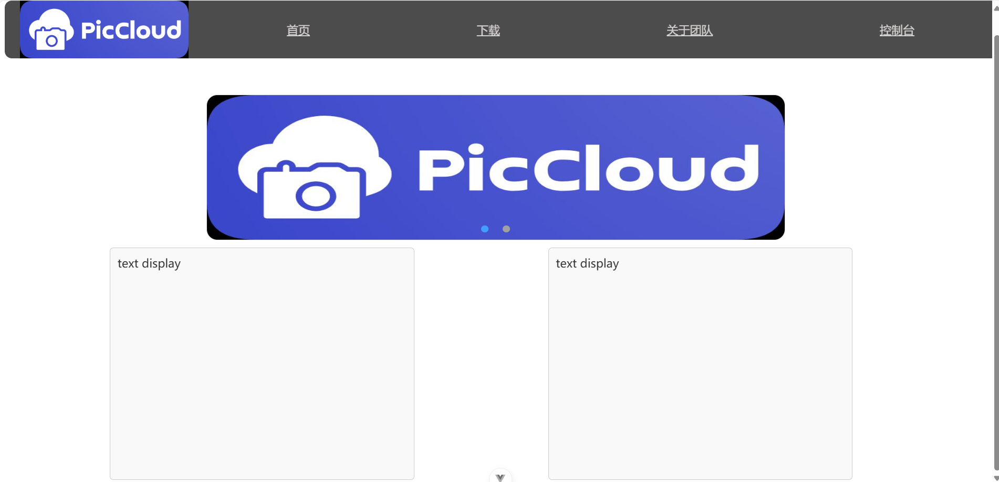
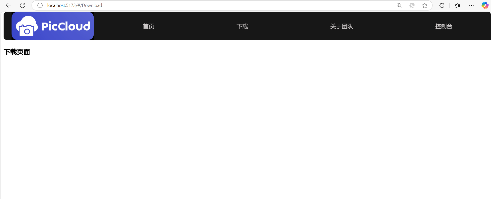
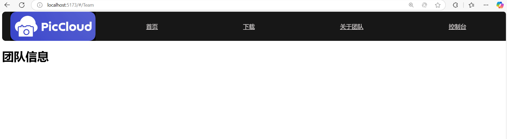
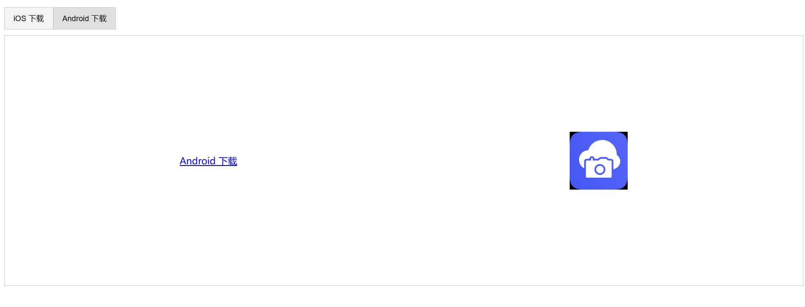
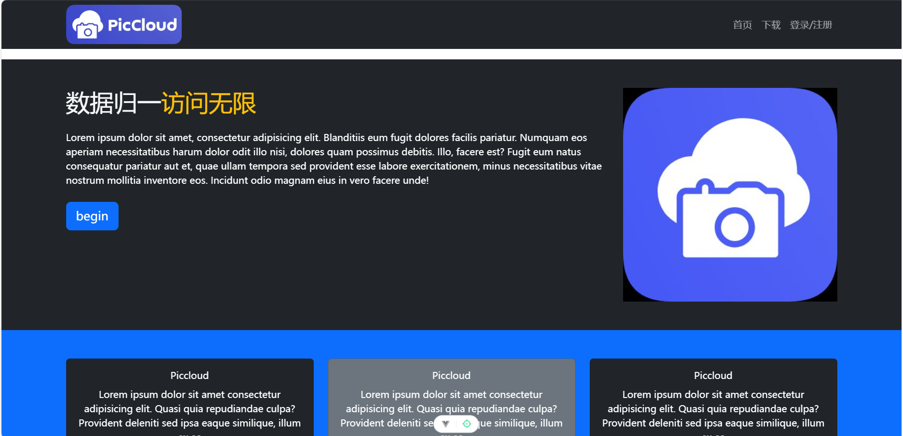
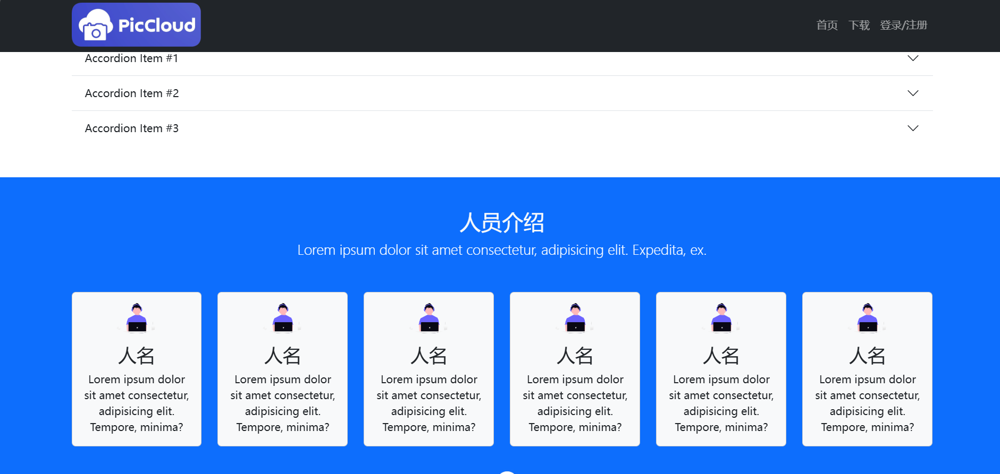
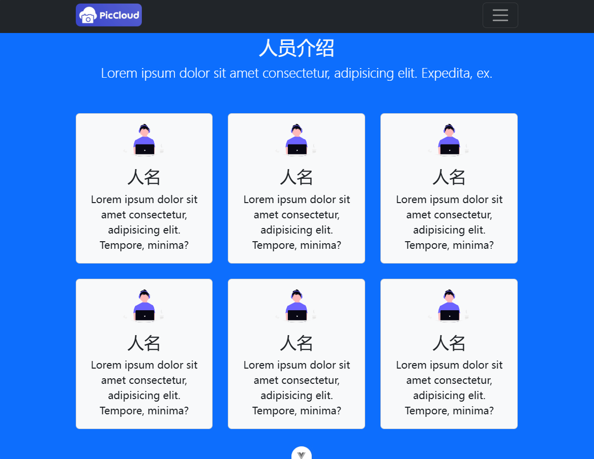
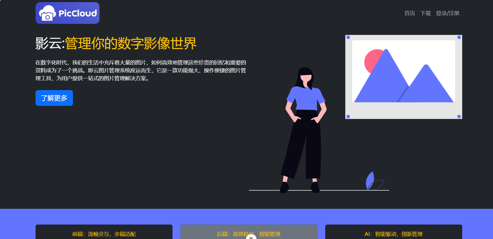

> PicCloud官网链接：https://pic-cloud.netlify.app/

# 开发日志

## 1.19 

非常粗略地实现官网的样式

## 1.20 

使用动态组件的方式，监听浏览器 hashchange 事件实现简单的页面路由
实际上是将官网设计为单页面应用程序（SPA），这样允许在不刷新页面的情况下改变页面的部分内容，实现不同 “页面” 之间的切换，给用户一种多页面应用的体验，而实际上整个页面并没有重新加载。

## 1.21 

完善简略的下载界面

## 1.24 

使用了bootStrap组件库丰富了页面内容

实现了响应式布局

## 1.25 

填充文字并使用了unDraw的一些图片资源丰富页面内容
